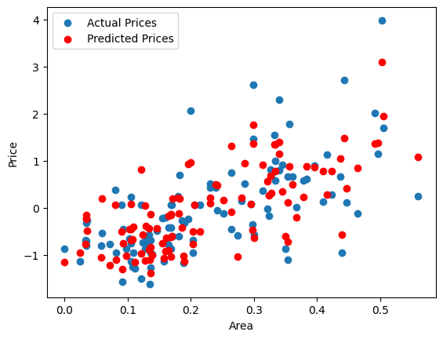

# House Price Prediction using Neural Network

## Project Overview
This project aims to predict house prices based on various features using a linear regression model implemented with PyTorch. The dataset includes attributes such as area, location, and amenities, which influence the pricing of houses.

## Dataset
The dataset used for this project is `Housing-1.csv`. It contains the following columns:

- **area**: The size of the house in square feet.
- **mainroad**: Indicates if the house is on the main road (binary).
- **guestroom**: Indicates if the house has a guest room (binary).
- **basement**: Indicates if the house has a basement (binary).
- **hotwaterheating**: Indicates if the house has hot water heating (binary).
- **airconditioning**: Indicates if the house has air conditioning (binary).
- **prefarea**: Indicates if the house is in a preferred area (binary).
- **furnishingstatus**: The furnishing status of the house (multi-class).
- **price**: The price of the house (target variable).

## Libraries Required
To run this notebook, you need the following Python libraries:

- `pandas`
- `scikit-learn`
- `torch`
- `matplotlib`

You can install these packages using pip:

pip install pandas scikit-learn torch matplotlib

## Steps to Run the Notebook
1. Clone or download the repository to your local machine.
2. Ensure you have Python installed on your system.
3. Install the required libraries as mentioned above.
4. Open the Jupyter Notebook (or any compatible environment).
5. Load the dataset Housing-1.csv into the notebook.
6. Run the notebook cells sequentially to preprocess the data, train the model, and visualize the results.

## Model Training
The model is trained using a linear regression approach with the following steps:

1. Data Preprocessing:

- Encoding categorical features using Label Encoding.
- Normalizing the area feature using MinMaxScaler.
- Splitting the dataset into training and validation sets.

2. Model Definition:

- A simple linear regression model is defined using PyTorch.

3. Training:

- The model is trained for 2000 epochs using the AdamW optimizer and Mean Squared Error loss function.

4. Evaluation:

- The model's performance is evaluated using Mean Squared Error (MSE), Mean Absolute Error (MAE), and R-squared metrics.

5. Visualization:

- A scatter plot is generated to compare the actual and predicted house prices.

## Results
After training, the model's performance metrics will be printed, and a visualization will display the predicted prices against the actual prices based on the validation set.

