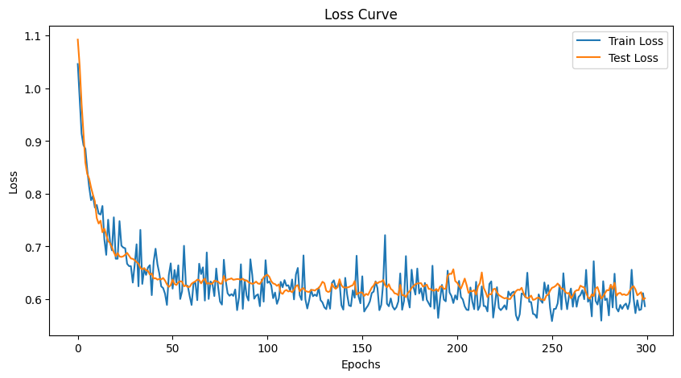
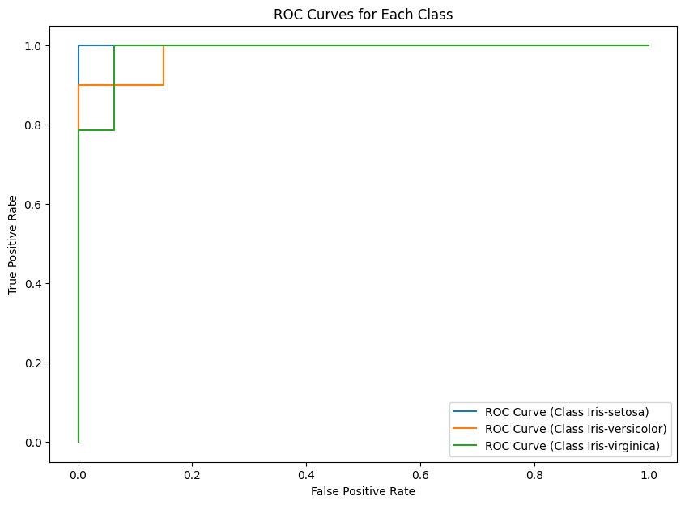

# Iris Classification using PyTorch Neural Network

This project implements a neural network in PyTorch to classify the **Iris dataset** species using four features. It includes preprocessing steps, model creation, training, evaluation, and visualization of results, such as the loss curve and ROC curves for each class.

---

## Table of Contents
1. [Overview](#overview)  
2. [Dataset](#dataset)  
3. [Installation](#installation)  
4. [Model Architecture](#model-architecture)  
5. [Training Procedure](#training-procedure)  
6. [Results](#results)  
7. [Usage](#usage)  
8. [Visualizations](#visualizations)  

---

## Overview
This project builds a neural network using **PyTorch** to classify flowers in the Iris dataset into three species. We apply **StandardScaler** for feature scaling and **OneHotEncoder** for encoding target labels. The model’s performance is evaluated using metrics such as **accuracy**, **confusion matrix**, **classification report**, and **ROC curves**.

---

## Dataset
The **Iris dataset** consists of:
- **Features**: Sepal length, Sepal width, Petal length, Petal width  
- **Target**: Species (Setosa, Versicolor, Virginica)  

---

## Installation
To run the project, install the required packages using the following commands:

```bash
# Clone the repository
git clone <your-repository-url>

# Change into the directory
cd <your-repository-directory>

# Install dependencies
pip install torch torchvision scikit-learn matplotlib pandas 
```

---

## Model Architecture
The model is built with four linear layers and includes **batch normalization** and **dropout regularization**:

1. **Input Layer**: 4 features  
2. **Hidden Layer 1**: 128 neurons + ReLU + BatchNorm + Dropout(0.5)  
3. **Hidden Layer 2**: 64 neurons + ReLU + BatchNorm + Dropout(0.3)  
4. **Hidden Layer 3**: 32 neurons + ReLU + BatchNorm  
5. **Hidden Layer 4**: 16 neurons + ReLU + BatchNorm  
6. **Output Layer**: 3 neurons (Softmax activation for multi-class classification)

---

## Training Procedure
1. **Optimizer**: Adam with a learning rate of 0.001  
2. **Loss Function**: Cross-Entropy Loss  
3. **Batch Size**: 16  
4. **Epochs**: 300  
5. **Data Split**: 80% Train, 20% Test

The model is trained on the **train set** and validated on the **test set** to monitor performance. Loss curves are plotted to visualize the training and test loss over epochs.

---

## Results
### Model Performance
- **Accuracy**: `96.67%`  
- **Confusion Matrix**:
    ```
    [[ 6  0  0]
    [ 0  9  1]
    [ 0  0 14]]
    ```

- **Classification Report**:
    ```
   
                  Precision | Recall | F1-score | Support  
                  --------- | ------ | -------- | -------  
    Setosa       |   1.00   |  1.00  |  1.00    |   6  
    Versicolor   |   1.00   |  0.90  |  0.95    |   10  
    Virginica    |   0.93   |  1.00  |  0.97    |   16  

    Accuracy     |          |        |  0.97    |   30
    Macro avg    |   0.98   |  0.97  |  0.97    |   30
    Weighted avg |   0.97   |  0.97  |  0.97    |   30
    ```

---

## Usage
To run the notebook locally, follow these steps:

1. Ensure you have installed the dependencies (see the [Installation](#installation) section).  
2. Load the `iris.csv` dataset in the same directory as the notebook.  
3. Run the cells sequentially to:
   - Load and preprocess the data.
   - Define and train the model.
   - Evaluate the model with metrics such as accuracy, classification report, and confusion matrix.
   - Visualize loss curves and ROC curves.

---

## Visualizations
1. **Loss Curve**  
     
   The loss curve shows the model’s training and test losses over the 300 epochs.  

2. **ROC Curves**  
     
   ROC curves for each class display the trade-off between **true positive rate** and **false positive rate**.

---