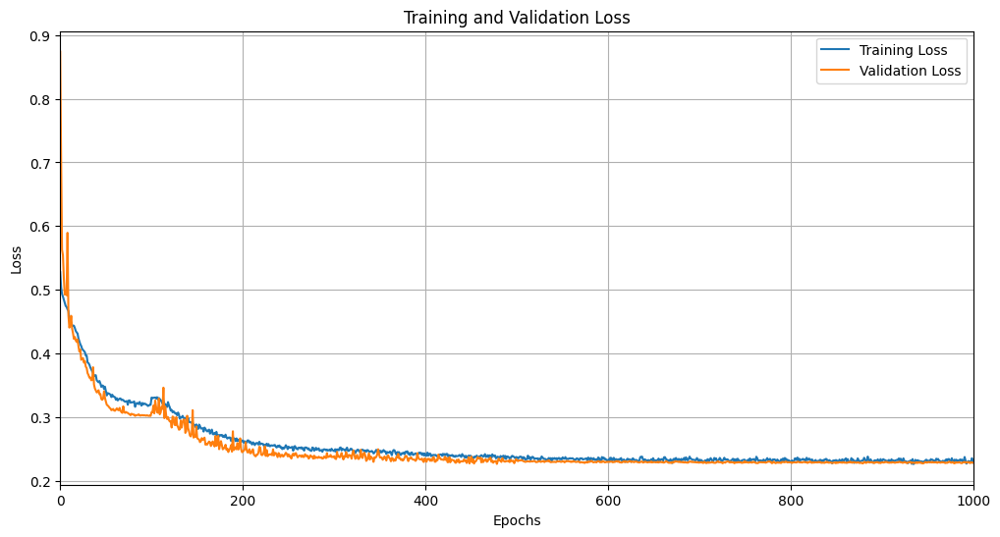

# Heart Disease Prediction Using Neural Networks  

## Overview  
This project involves building a deep learning model to predict the presence of heart disease based on health indicators. It employs data preprocessing techniques such as scaling and handling class imbalance, followed by training a neural network using TensorFlow/Keras. The dataset used is **`heart_disease_health_indicators.csv`**.  

---

## Table of Contents  
1. [Project Structure](#project-structure)  
2. [Dataset](#dataset)  
3. [Preprocessing Steps](#preprocessing-steps)  
4. [Model Architecture](#model-architecture)  
5. [Training Process](#training-process)  
6. [Evaluation](#evaluation)  
7. [Installation and Usage](#installation-and-usage)  
8. [Results](#results)    

---

## 1. Project Structure  
- **Notebook**: Contains the main code for data preprocessing, model training, and evaluation.  
- **Dataset**: `heart_disease_health_indicators.csv`.  
- **Plots and Outputs**:  
  - **Training and Validation Loss Curves**  
  - **Confusion Matrix**  
  - **ROC-AUC Curve**  

---

## 2. Dataset  
The dataset consists of various health indicators, including BMI, physical health metrics, mental health status, general health ratings, and education levels. The target variable is **`HeartDiseaseorAttack`**, where:  
- `0`: No heart disease or attack  
- `1`: Heart disease or attack  

---

## 3. Preprocessing Steps  
1. **Scaling**: Used `StandardScaler` to normalize the feature values.  
2. **Duplicate Removal**: Dropped duplicate entries.  
3. **Outlier Filtering**: Removed outliers using the 75th percentile for BMI, Physical Health, Mental Health, and General Health, and the 25th percentile for Education and Income.  
4. **SMOTE**: Applied **Synthetic Minority Oversampling Technique** (SMOTE) to balance the dataset by oversampling the minority class (heart disease cases).  

---

## 4. Model Architecture  
The neural network is built using **TensorFlow/Keras** with the following architecture:  
- **Input Layer**: `512` neurons, ReLU activation  
- **Hidden Layers**:  
  - 256 neurons → Dropout(0.5) → BatchNormalization  
  - 128 neurons → Dropout(0.4) → BatchNormalization  
  - 64 neurons → BatchNormalization  
  - 32 neurons → BatchNormalization  
  - 16 neurons → BatchNormalization  
- **Output Layer**: 1 neuron, Sigmoid activation for binary classification  

**Optimizer**: Adam with a varying learning rate  
**Loss Function**: Binary Crossentropy  

---

## 5. Training Process  
- **Epochs**: Up to 1000 epochs with several training phases  
- **Batch Size**: 256  
- **Callbacks**:  
  - **Learning Rate Scheduler**: Dynamic learning rate adjustment across different training phases  
  - **Early LR Adjustments**: Start with higher learning rates and gradually reduce them over time  

The following code merges multiple training phases:  

```python
history = {
    key: history[key] + history1.history[key]
    for key in history
}
```
## 6. Evaluation  
The model’s performance is evaluated using several metrics and visualizations, including the confusion matrix, classification report, and ROC-AUC curve.

### 6.1 Confusion Matrix  
The confusion matrix provides insights into the model’s performance by showing the counts of true positives, true negatives, false positives, and false negatives.  

Confusion Matrix:
[[TN  FP]
 [FN  TP]]

### 6.2 Classification Report
The classification report summarizes key metrics such as precision, recall, F1-score, and support for both classes (0 and 1).


Classification Report:
               precision    recall  f1-score   support
           0       0.xx      0.xx      0.xx     [count]
           1       0.xx      0.xx      0.xx     [count]
    accuracy                           0.xx     [total]
   macro avg       0.xx      0.xx      0.xx     [total]
weighted avg       0.xx      0.xx      0.xx     [total]


### 6.3 ROC-AUC Curve
The ROC-AUC curve shows the trade-off between the true positive rate (TPR) and the false positive rate (FPR). The Area Under the Curve (AUC) provides a single measure of model performance.


### 6.4 Loss Curves
Visualizing the training and validation loss over epochs helps in diagnosing overfitting or underfitting.



## 7. Installation and Usage

1. Clone the repository or download the notebook.
2. Install the required libraries.
3. Run the notebook in your preferred environment (e.g., Jupyter Notebook or Google Colab).
4. Ensure the heart_disease_health_indicators.csv dataset is available in the working directory.


## 8. Results
- **Test Accuracy**: Achieved after 1000 epochs of training.
- **ROC-AUC Score**: Visualized using the ROC-AUC curve to assess classification performance.
- **Loss Curves**: Plotted to observe the training and validation loss over time.


