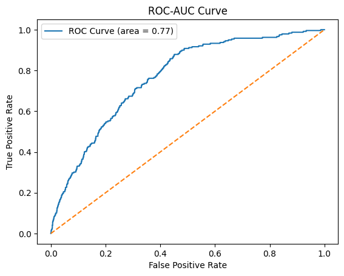
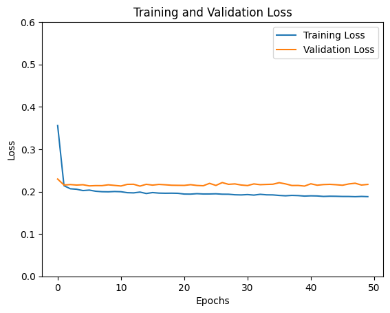
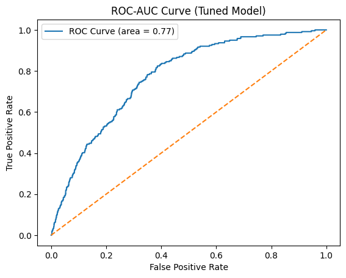
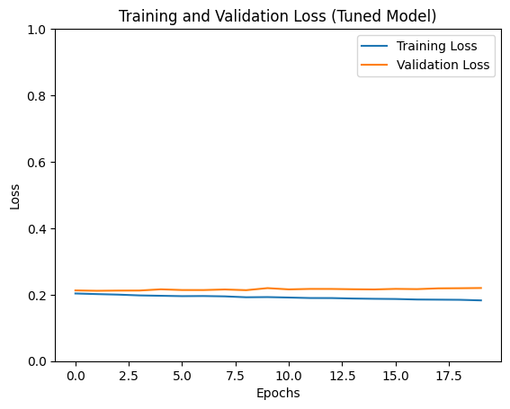

# Heart Disease Prediction using Neural Networks

This project aims to predict the occurrence of heart disease using a neural network model built with Keras and TensorFlow. The dataset used is `heart_disease_health_indicators.csv`. The workflow involves data preprocessing, model training, hyperparameter tuning, and performance evaluation using metrics like ROC-AUC and confusion matrices.

---

## Table of Contents
1. [Project Overview](#project-overview)  
2. [Dataset](#dataset)  
3. [Technologies Used](#technologies-used)  
4. [Project Workflow](#project-workflow)  
5. [Usage](#usage)  
6. [Results](#results)  

---

## Project Overview
This project explores the use of a neural network to predict heart disease based on various health indicators. The model is trained to classify whether a person is likely to have a heart disease event. The notebook includes the following key steps:
- Data preprocessing and visualization  
- Building a neural network with hyperparameter tuning using Keras Tuner  
- Evaluating the model's performance with metrics such as confusion matrix, ROC-AUC curve, and loss plots.

---

## Dataset
The dataset, `heart_disease_health_indicators.csv`, contains several health and demographic indicators, including:
- **BMI (Body Mass Index)**  
- **Physical and Mental Health metrics**  
- **General Health and Education Levels**  
- **Income Level**  
- **Binary Target Label:** `HeartDiseaseorAttack` (1 = presence of heart disease or attack, 0 = absence)

---

## Technologies Used
- **Python**  
- **Pandas**: For data manipulation and preprocessing  
- **Seaborn/Matplotlib**: For visualization  
- **Scikit-learn**: For scaling and splitting the data  
- **TensorFlow / Keras**: For building, training, and evaluating neural networks  
- **Keras Tuner**: For hyperparameter tuning  
- **Jupyter Notebook**

---

## Project Workflow

### 1. **Data Preprocessing**
- Duplicates are removed to ensure data quality.
- StandardScaler is used to normalize the data.
- Outliers are identified through box plots, and filters are applied based on quantile thresholds.

### 2. **Model Building**
- A **Sequential neural network** with the following architecture:
  - Input Layer: Based on the number of features
  - Hidden Layers: 64 and 32 neurons with ReLU activation  
  - Dropout and Batch Normalization: To prevent overfitting  
  - Output Layer: Single neuron with sigmoid activation for binary classification

### 3. **Learning Rate Scheduler**
- A **custom learning rate scheduler** adjusts the learning rate every 5 epochs to improve convergence.

### 4. **Training and Evaluation**
- The model is trained for **50 epochs** with 20% of the data used for validation.  
- Performance is evaluated using:
  - **Confusion Matrix**
  - **Classification Report** (Precision, Recall, F1-Score)
  - **ROC-AUC Curve**

### 5. **Hyperparameter Tuning**
- **Keras Tuner** is used to search for the best hyperparameters.
- A separate neural network is trained with the best parameters found by the tuner.

---

## Usage
To run the project locally, follow these steps:

1. **Clone the repository**  
   ```bash
   git clone <repository-url>
   cd <repository-directory>```

2. Install the required libraries

    ```bash
    Copy code
    pip install -r requirements.txt```

3.  Run the Jupyter Notebook

    ```bash
    Copy code
    jupyter notebook heart_disease_prediction.ipynb```

4. Download the dataset and place it in the project directory.

## Results
**Initial Model Performance:**
- **Test Accuracy:** 93.41%
- **ROC-AUC Curve:** 


- **Confusion Matrix**:
  ```bash
 [[3384    1]
 [ 238    1]]```
- **Classification Report:**
```
               precision    recall  f1-score   support

           0       0.93      1.00      0.97      3385
           1       0.50      0.00      0.01       239

    accuracy                           0.93      3624
   macro avg       0.72      0.50      0.49      3624
weighted avg       0.91      0.93      0.90      3624
```

- **Loss Plot:**



**Tuned Model Performance:**
- **Test Accuracy:** 93.24%
- **ROC-AUC Curve:**



- **Confusion Matrix**:
 [[3379    6]
 [ 239    0]]
- **Classification Report:**
               precision    recall  f1-score   support

           0       0.93      1.00      0.97      3385
           1       0.00      0.00      0.00       239

    accuracy                           0.93      3624
   macro avg       0.47      0.50      0.48      3624
weighted avg       0.87      0.93      0.90      3624
- **Loss Plot:**



