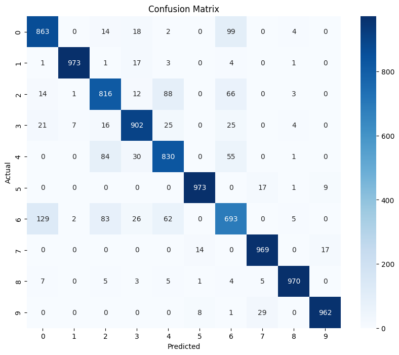
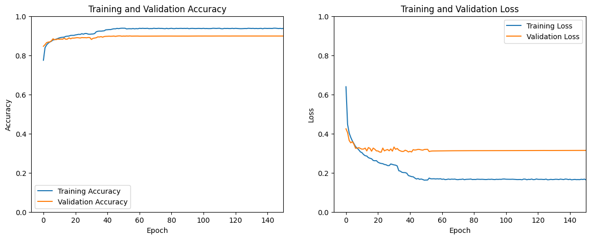

# Fashion MNIST Classification with Keras

This project implements a multiclass classification model using Keras with a TensorFlow backend to classify fashion items from the Fashion MNIST dataset. The dataset consists of 28x28 grayscale images representing ten different fashion categories.

## Dataset

- **Fashion MNIST** consists of 70,000 images:
  - 60,000 images for training
  - 10,000 images for testing
- Each image belongs to one of the following 10 classes:
  - T-shirt/top
  - Trouser
  - Pullover
  - Dress
  - Coat
  - Sandal
  - Shirt
  - Sneaker
  - Bag
  - Ankle boot

## Steps

1. **Load and Preprocess the Dataset:**
   - Load the Fashion MNIST dataset.
   - Normalize the pixel values to the range [0, 1].
   - Reshape the images into 1D vectors of size 784.

2. **Split the Data:**
   - Split the training data into training and validation sets using an 80-20 split.

3. **Data Augmentation:**
   - Implement data augmentation using Keras’ `ImageDataGenerator` to improve model performance.

4. **Model Architecture:**
   - Create a Sequential model using Keras with:
     - An input layer with 128 neurons and ReLU activation.
     - Batch normalization layers.
     - Dropout layers for regularization.
     - An output layer with 10 neurons and softmax activation.

5. **Compile the Model:**
   - Use the Adam optimizer and sparse categorical cross-entropy loss function.
   - Monitor accuracy as a performance metric.

6. **Training the Model:**
   - Train the model using early stopping to prevent overfitting.
   - Save the best model using model checkpointing.
   - Use a learning rate scheduler to adjust the learning rate during training.

7. **Evaluate the Model:**
   - Evaluate the model on the test set and report accuracy.
   - Generate and display the classification report and confusion matrix.

8. **Visualization:**
   - Plot the training and validation accuracy and loss curves.

## Requirements

- TensorFlow
- Keras
- NumPy
- Matplotlib
- Seaborn
- scikit-learn

You can install the required libraries using:

```bash
pip install tensorflow numpy matplotlib seaborn scikit-learn
```

## Results

- Test Accuracy: 89.51%

- Classification Report

```

               precision    recall  f1-score   support

 T-shirt/top       0.83      0.86      0.85      1000
     Trouser       0.99      0.97      0.98      1000
    Pullover       0.80      0.82      0.81      1000
       Dress       0.89      0.90      0.90      1000
        Coat       0.82      0.83      0.82      1000
      Sandal       0.98      0.97      0.97      1000
       Shirt       0.73      0.69      0.71      1000
     Sneaker       0.95      0.97      0.96      1000
         Bag       0.98      0.97      0.98      1000
  Ankle boot       0.97      0.96      0.97      1000

    accuracy                           0.90     10000
   macro avg       0.90      0.90      0.89     10000
weighted avg       0.90      0.90      0.89     10000

```

- Confusion Matrix



- Training Vs Validation Accuracy and Loss Curves

