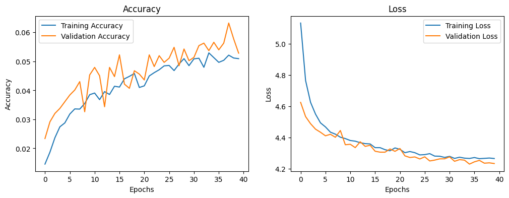
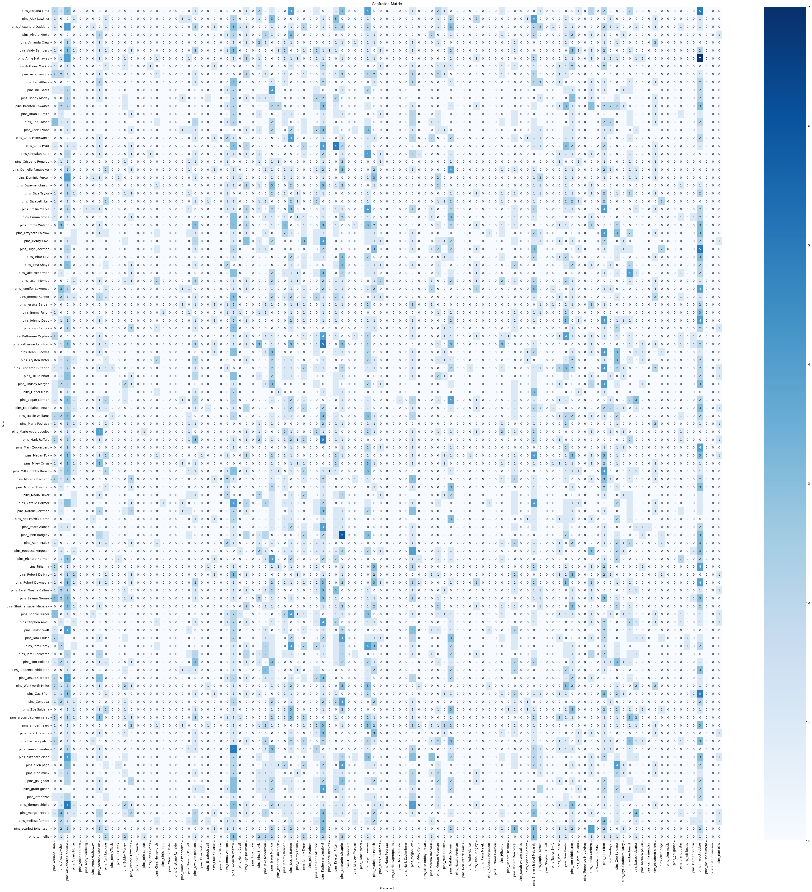

# Multiclass Face Recognition with Keras

This project builds a multiclass classification model using Keras to classify images of faces from the Pins Face Dataset on Kaggle. The dataset consists of 105 unique classes, each representing a different individual, and the objective is to classify each image based on the identity of the person.

## Objective
The goal of this project is to develop a model that can achieve at least **85% accuracy** on the validation dataset by correctly identifying individuals based on their facial images.

## Dataset
The dataset, **Pins Face Dataset**, contains facial images grouped into folders by individual, where:
- Each folder corresponds to a different person (celebrity).
- The images are of various resolutions and need preprocessing for model compatibility.

Dataset can be found [here](https://www.kaggle.com/datasets/hereisburak/pins-face-recognition).

## Model Architecture

We use a **Fully Connected Artificial Neural Network (ANN)** with:
- Input layer: Flattened 100x100 RGB image vector (10,000 features).
- Three hidden layers with **ReLU activation** and **Batch Normalization**.
- **Dropout** layers to prevent overfitting.
- Output layer with **Softmax activation** for multiclass classification.

## Steps
1. **Data Loading and Preprocessing**:
    - **Image Resizing**: All images are resized to 100x100 pixels.
    - **Normalization**: Pixel values are scaled to a range of 0 to 1.
    - **Splitting**: Data is split into 80% for training and 20% for validation.
    - **Augmentation**: Random flips, rotations, zooms, and shifts are applied to improve generalization.
2. **Model Training**:
    - **Callbacks**: Early stopping and learning rate reduction are used to improve training efficiency.
    - **Optimizer**: Adam optimizer.
    - **Loss Function**: Categorical Crossentropy.
3. **Evaluation**:
    - Model accuracy and loss are tracked.
    - Performance metrics such as precision, recall, and F1-score are computed.
    - A confusion matrix provides insight into misclassifications.

## Dependencies

To run this notebook, the following dependencies are required:

- `tensorflow`
- `numpy`
- `matplotlib`
- `seaborn`
- `scikit-learn`

You can install these dependencies with:

```bash
pip install tensorflow numpy matplotlib seaborn scikit-learn
```

## Running the Notebook

1. **Download the Dataset**: Ensure the dataset is accessible in the directory `/kaggle/input/105-classes-pins-dataset/105_classes_pins_dataset`.
2. **Execute Cells Sequentially**: Run the notebook cell by cell to load data, preprocess, build and train the model, and evaluate its performance.
3. **View Results**: The notebook will display training and validation accuracy and loss curves, as well as the confusion matrix and classification report, to provide insights into the model's performance.

## Results

- **Validation Accuracy**: 5.458 %
- **Classification Report**: 
```
                             precision    recall  f1-score   support

          pins_Adriana Lima       0.03      0.05      0.04        42
          pins_Alex Lawther       0.00      0.00      0.00        30
    pins_Alexandra Daddario       0.02      0.09      0.04        45
          pins_Alvaro Morte       0.00      0.00      0.00        27
           pins_Amanda Crew       0.00      0.00      0.00        23
          pins_Andy Samberg       0.00      0.00      0.00        39
         pins_Anne Hathaway       0.00      0.00      0.00        40
        pins_Anthony Mackie       0.00      0.00      0.00        24
         pins_Avril Lavigne       0.00      0.00      0.00        32
           pins_Ben Affleck       0.00      0.00      0.00        25
            pins_Bill Gates       0.00      0.00      0.00        24
          pins_Bobby Morley       0.03      0.04      0.04        27
      pins_Brenton Thwaites       0.00      0.00      0.00        41
        pins_Brian J. Smith       0.00      0.00      0.00        20
           pins_Brie Larson       0.00      0.00      0.00        33
           pins_Chris Evans       0.00      0.00      0.00        33
       pins_Chris Hemsworth       0.00      0.00      0.00        31
           pins_Chris Pratt       0.00      0.00      0.00        35
        pins_Christian Bale       0.00      0.00      0.00        30
     pins_Cristiano Ronaldo       0.00      0.00      0.00        19
    pins_Danielle Panabaker       0.00      0.00      0.00        36
       pins_Dominic Purcell       0.00      0.00      0.00        29
        pins_Dwayne Johnson       0.00      0.00      0.00        28
          pins_Eliza Taylor       0.00      0.00      0.00        32
        pins_Elizabeth Lail       0.14      0.03      0.05        31
         pins_Emilia Clarke       0.00      0.00      0.00        42
            pins_Emma Stone       0.00      0.00      0.00        27
           pins_Emma Watson       0.00      0.00      0.00        42
       pins_Gwyneth Paltrow       0.01      0.03      0.01        37
           pins_Henry Cavil       0.00      0.00      0.00        39
          pins_Hugh Jackman       0.00      0.00      0.00        35
            pins_Inbar Lavi       0.00      0.00      0.00        25
           pins_Irina Shayk       0.00      0.00      0.00        31
         pins_Jake Mcdorman       0.00      0.00      0.00        31
           pins_Jason Momoa       0.02      0.06      0.03        36
     pins_Jennifer Lawrence       0.00      0.00      0.00        36
         pins_Jeremy Renner       0.02      0.03      0.02        33
        pins_Jessica Barden       0.01      0.04      0.01        28
          pins_Jimmy Fallon       0.00      0.00      0.00        22
           pins_Johnny Depp       0.02      0.03      0.02        36
           pins_Josh Radnor       0.00      0.00      0.00        23
      pins_Katharine Mcphee       0.02      0.03      0.02        35
    pins_Katherine Langford       0.03      0.11      0.05        45
          pins_Keanu Reeves       0.00      0.00      0.00        32
        pins_Krysten Ritter       0.00      0.00      0.00        34
     pins_Leonardo DiCaprio       0.02      0.04      0.03        47
         pins_Lili Reinhart       0.00      0.00      0.00        30
        pins_Lindsey Morgan       0.00      0.00      0.00        33
          pins_Lionel Messi       0.00      0.00      0.00        17
          pins_Logan Lerman       0.01      0.02      0.01        42
      pins_Madelaine Petsch       0.00      0.00      0.00        38
       pins_Maisie Williams       0.00      0.00      0.00        38
         pins_Maria Pedraza       0.00      0.00      0.00        24
    pins_Marie Avgeropoulos       0.00      0.00      0.00        32
          pins_Mark Ruffalo       0.00      0.00      0.00        35
       pins_Mark Zuckerberg       0.00      0.00      0.00        19
             pins_Megan Fox       0.01      0.02      0.01        41
           pins_Miley Cyrus       0.00      0.00      0.00        35
    pins_Millie Bobby Brown       0.00      0.00      0.00        38
       pins_Morena Baccarin       0.00      0.00      0.00        35
        pins_Morgan Freeman       0.00      0.00      0.00        21
          pins_Nadia Hilker       0.05      0.04      0.04        26
        pins_Natalie Dormer       0.00      0.00      0.00        39
       pins_Natalie Portman       0.00      0.00      0.00        33
   pins_Neil Patrick Harris       0.00      0.00      0.00        23
          pins_Pedro Alonso       0.00      0.00      0.00        25
          pins_Penn Badgley       0.00      0.00      0.00        34
            pins_Rami Malek       0.00      0.00      0.00        32
      pins_Rebecca Ferguson       0.00      0.00      0.00        35
        pins_Richard Harmon       0.00      0.00      0.00        29
               pins_Rihanna       0.00      0.00      0.00        26
        pins_Robert De Niro       0.00      0.00      0.00        31
      pins_Robert Downey Jr       0.02      0.02      0.02        46
   pins_Sarah Wayne Callies       0.00      0.00      0.00        31
          pins_Selena Gomez       0.00      0.00      0.00        37
pins_Shakira Isabel Mebarak       0.00      0.00      0.00        30
         pins_Sophie Turner       0.00      0.00      0.00        40
         pins_Stephen Amell       0.00      0.00      0.00        31
          pins_Taylor Swift       0.00      0.00      0.00        26
            pins_Tom Cruise       0.03      0.03      0.03        38
             pins_Tom Hardy       0.01      0.03      0.02        39
        pins_Tom Hiddleston       0.01      0.03      0.02        36
           pins_Tom Holland       0.00      0.00      0.00        37
    pins_Tuppence Middleton       0.00      0.00      0.00        26
        pins_Ursula Corbero       0.02      0.03      0.02        33
      pins_Wentworth Miller       0.00      0.00      0.00        35
             pins_Zac Efron       0.02      0.08      0.04        38
               pins_Zendaya       0.04      0.04      0.04        27
           pins_Zoe Saldana       0.03      0.05      0.03        37
   pins_alycia dabnem carey       0.00      0.00      0.00        42
           pins_amber heard       0.02      0.02      0.02        43
          pins_barack obama       0.00      0.00      0.00        23
        pins_barbara palvin       0.08      0.03      0.04        39
         pins_camila mendes       0.00      0.00      0.00        32
       pins_elizabeth olsen       0.00      0.00      0.00        44
            pins_ellen page       0.00      0.00      0.00        37
             pins_elon musk       0.00      0.00      0.00        27
             pins_gal gadot       0.00      0.00      0.00        39
          pins_grant gustin       0.05      0.03      0.04        36
            pins_jeff bezos       0.00      0.00      0.00        21
        pins_kiernen shipka       0.00      0.00      0.00        40
         pins_margot robbie       0.01      0.02      0.01        44
        pins_melissa fumero       0.00      0.00      0.00        30
    pins_scarlett johansson       0.00      0.00      0.00        40
             pins_tom ellis       0.00      0.00      0.00        36

                   accuracy                           0.01      3463
                  macro avg       0.01      0.01      0.01      3463
               weighted avg       0.01      0.01      0.01      3463
```

## Visualization

1. **Training & Validation Curves**: 


2. **Confusion Matrix**: 


