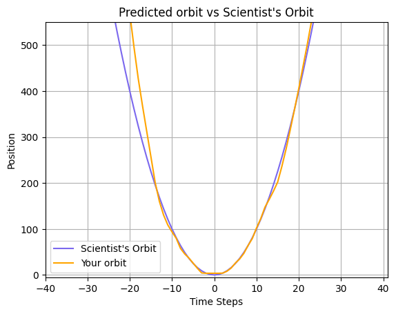

# Orbit Prediction using Neural Network
This project builds and trains a neural network to predict orbital patterns using a time series dataset. The model is implemented using TensorFlow/Keras and includes techniques such as batch normalization, dropout, and learning rate scheduling to improve performance.

## Contents of the Project
1. Data Preprocessing:

- Loading the dataset from orbit.csv.
- Splitting the data into training and validation sets using train_test_split.

2. Neural Network Architecture:

- A sequential model with multiple dense layers.
- Use of BatchNormalization, Dropout, and L2 regularization to reduce overfitting.

3. Training Process:

- Adam Optimizer is used with Mean Squared Error (MSE) as the loss function.
- Learning rate scheduling is applied using a step decay function.
- The model is trained for 100 epochs with batch size 32.

4. Model Evaluation:

- R² (R-squared) score is computed on the validation set.
- A plot compares the predicted orbital path with the scientist’s reference orbit.

## Dependencies
Make sure you have the following libraries installed:

pip install numpy pandas matplotlib scikit-learn tensorflow

## Files

orbit.csv: Contains the dataset with time_steps and y positions.
Notebook File: The code implementing the neural network model.

## How to Run the Code

Clone or download the project files.
Install the required dependencies.
Make sure the orbit.csv file is in the same directory as the notebook.
Run the notebook to see the outputs.

## Outputs

- R-squared Score:
The R² score indicates the model’s accuracy in predicting the orbital path.

R-squared: 0.9917929675807177

- Orbit Plot:
The plot compares the model’s predicted orbit with the scientist's reference orbit.

## Learning Rate Scheduling

The learning rate schedule uses a step decay function:

This helps the optimizer gradually reduce the learning rate to converge effectively.

## Conclusion

This notebook demonstrates how to train a neural network to predict time-series patterns. Techniques like batch normalization, dropout, and learning rate scheduling improve the model’s performance.